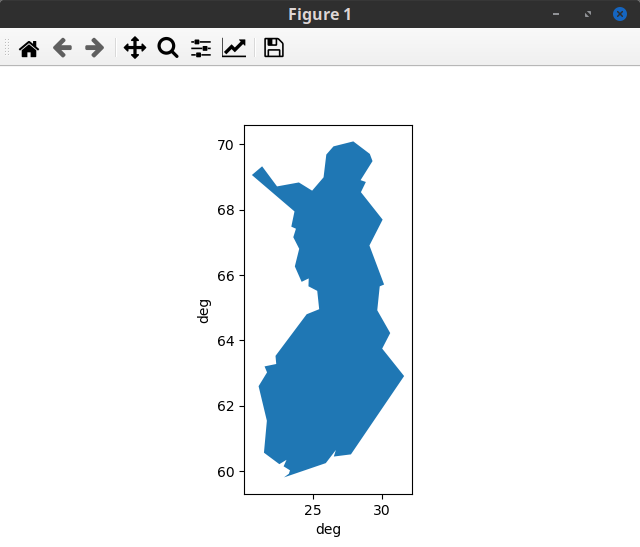
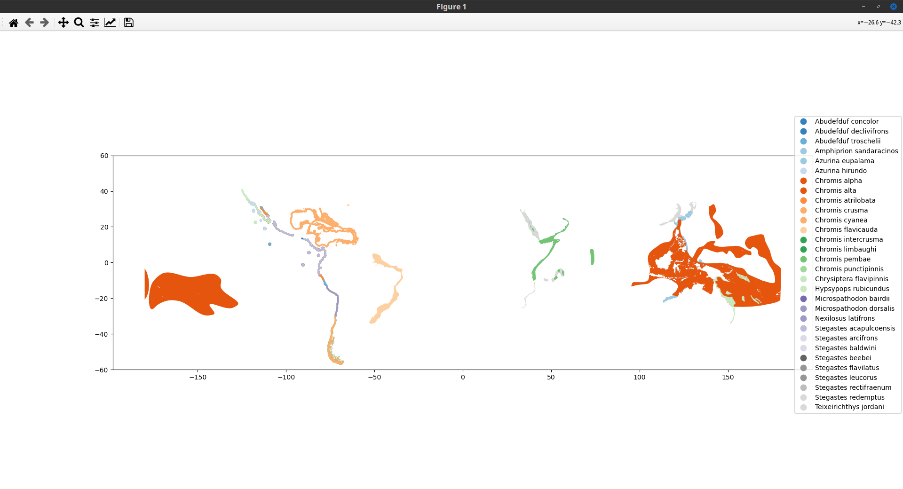
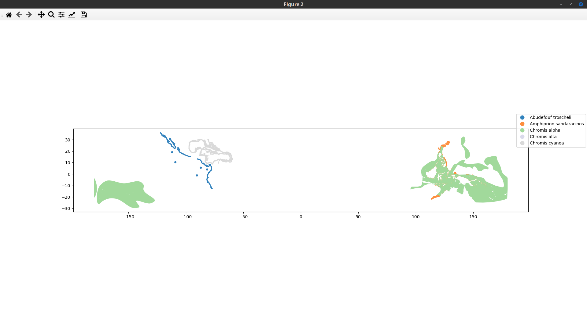
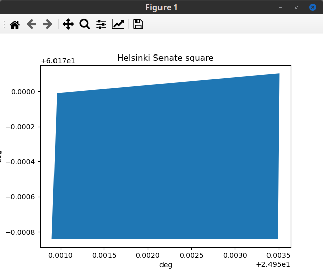
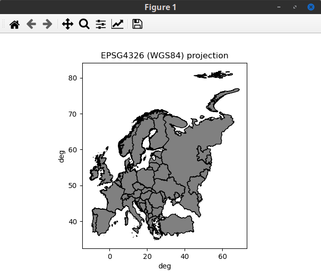
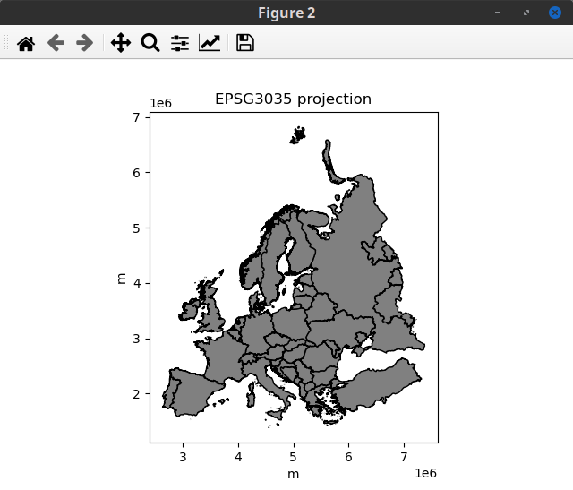
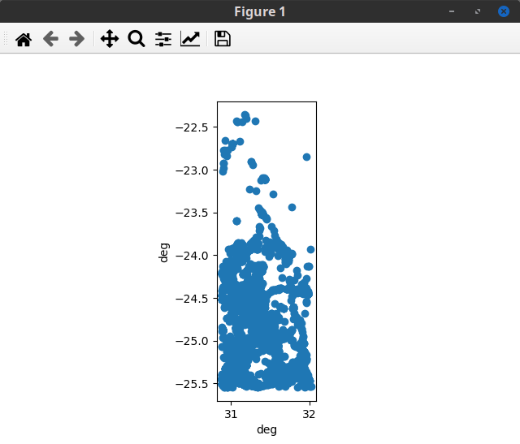
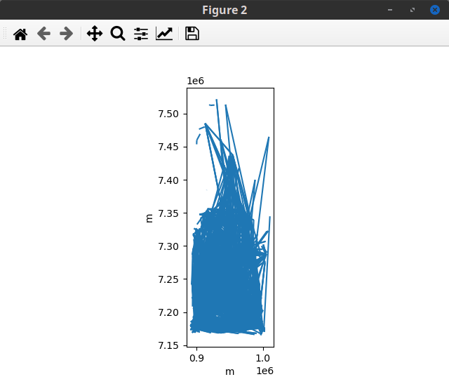

# Result `create_polygon.py`

 
Finland polygon 52 vertices

# Result `intro_geopandas.py`

 
Distribution damselfish species

 
Top-5 damselfish species by number of entries

 
Polygon Helsinki Senate square

# Result `map_projection.py`

 
Europe EPSG4326 (WGS84) projection

 
Europe EPSG3035 projection

# Result `southafrica.py`

 
Places for social media posts inside Kruger national park

 
Trips between posts

