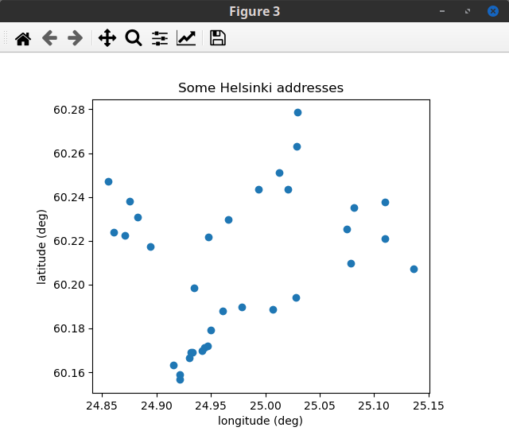
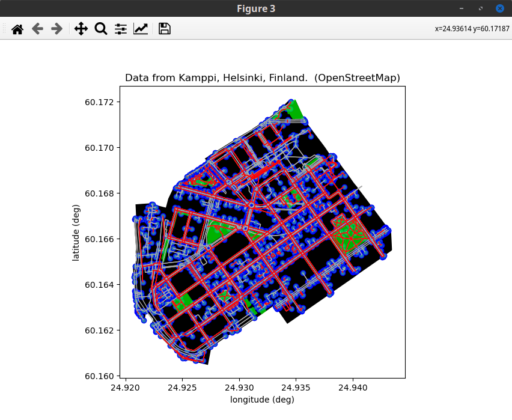
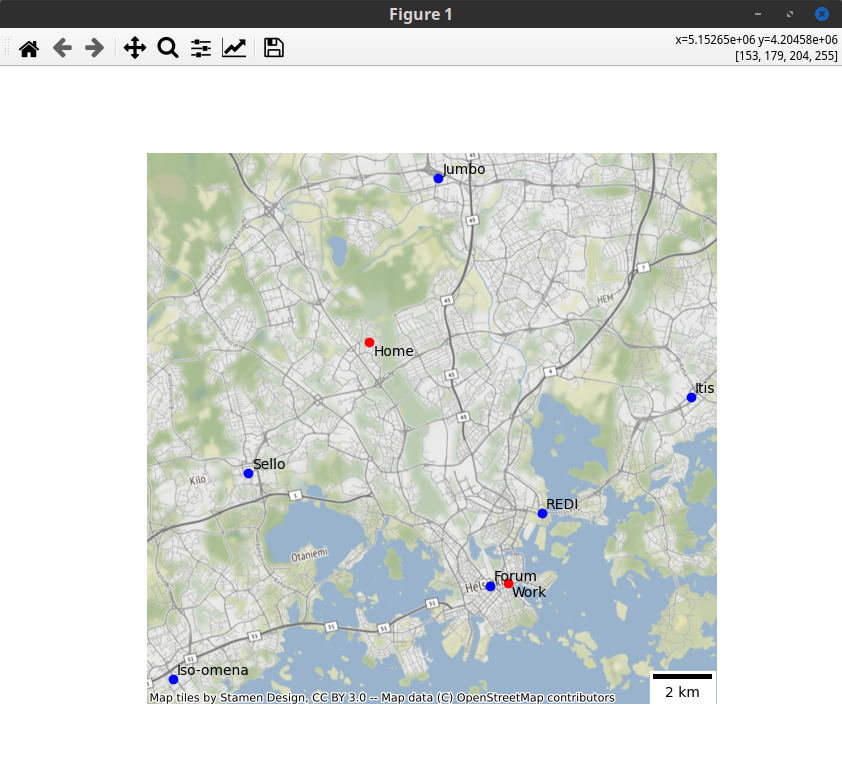
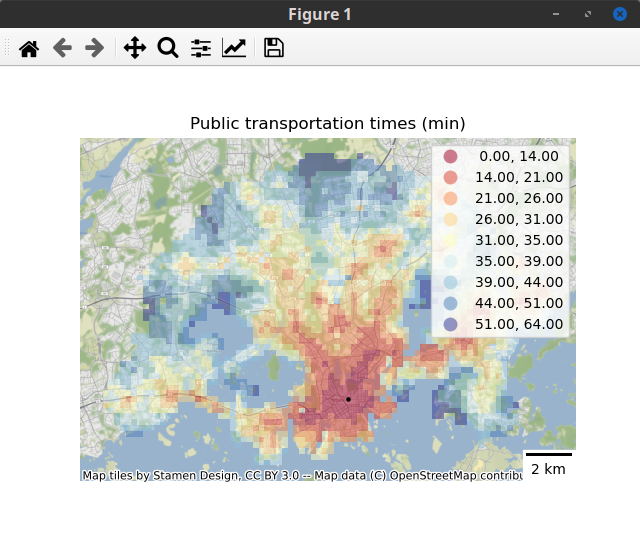
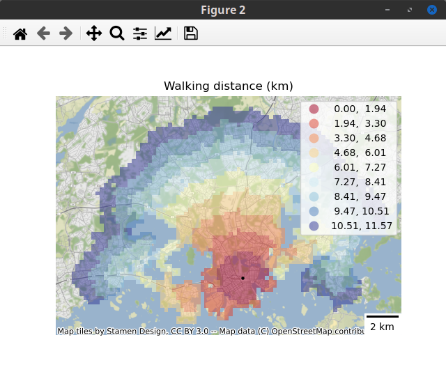
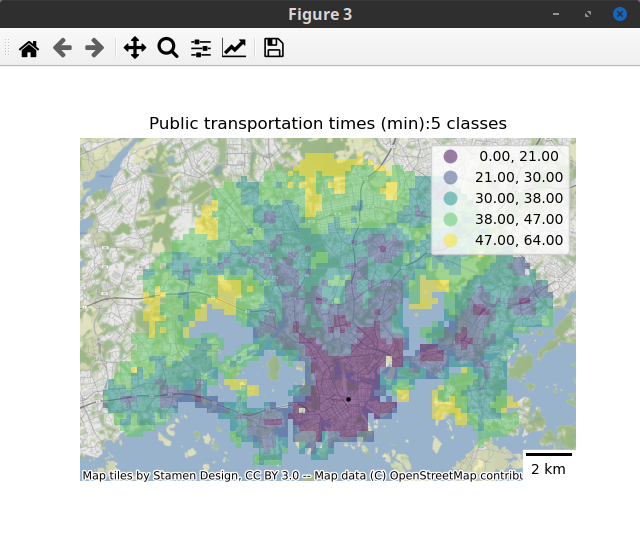
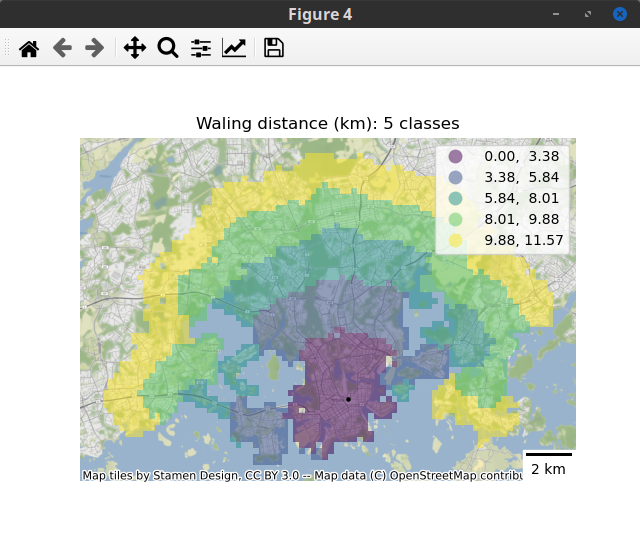
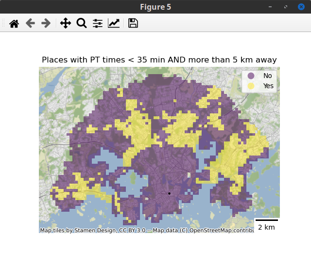

# Result `geocoding.py`
<p align="center">
<BR>
Geocoding for some addresses in Helsinki
</p>

# Result `data_osm.py`
<p align="center">
<BR>
Data from OSM. Blue: nodes. Gray: edges. Green: parks. Red: edged that are paths for walking.
</p>

# Result `exercise.py`
```
Malls ranked according the largest population in a 5-km radious
name
REDI         243034
Forum        216472
Itis         172280
Sello        170403
Iso-omena    104799
Jumbo         91444

Shopping center closets to Home:
Sello, at 5.99 km
Shopping center closets to Work:
Forum, at 0.62 km
```

<p align="center">
<BR>
Malls in Helsinki, and fake Home and Work locations
</p>

# Result `reclassification.py`
Centroid:
```
Longitude 24.94 deg, Latitude 60.17 deg
```
<p align="center">
<BR>
Public transportation (PT) times from dot
</p>

<p align="center">
<BR>
Walking distances from dot
</p>

<p align="center">
<BR>
Public transportation (PT) times from dot. 5 classes
</p>

<p align="center">
<BR>
Walking distances from dot. 5 classes
</p>

<p align="center">
<BR>
Binary classification of places. Is PT < 35 minutes AND waling distance < 5km, from this places to dot?
</p>
